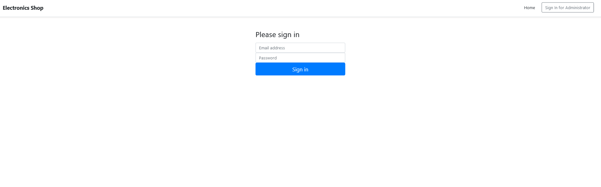
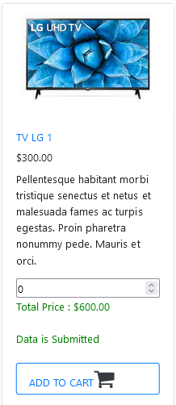
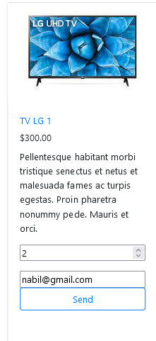
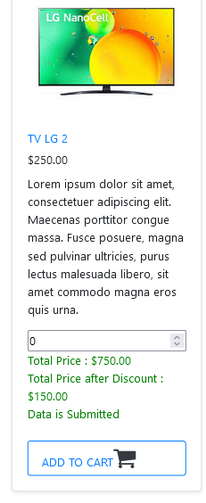
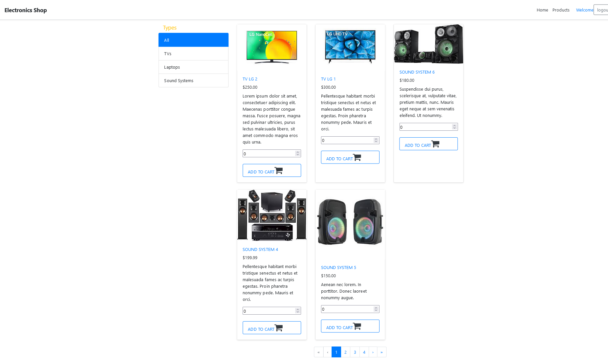
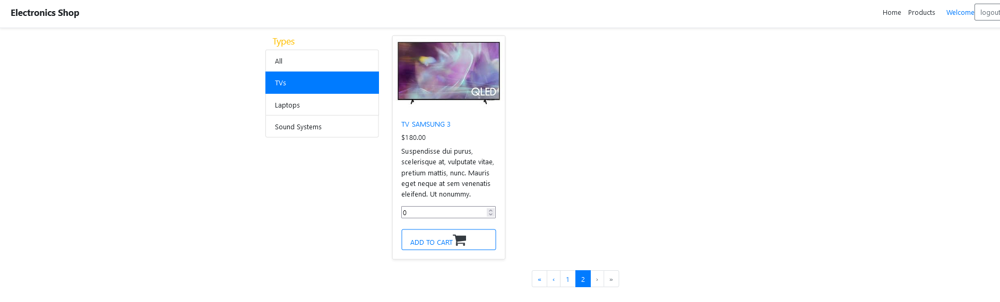
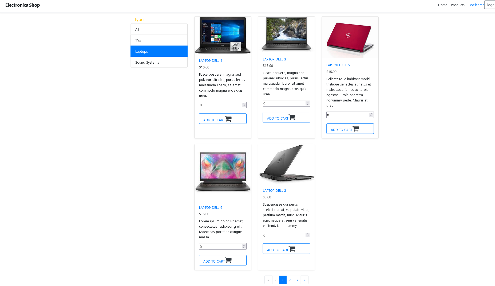
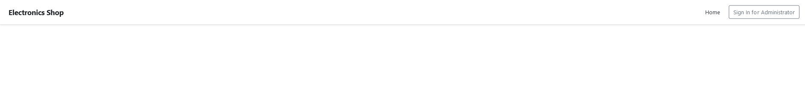
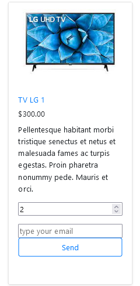

# Electronics Shop Onion-Architecture (Angular & .net Core API)

## API   
#### build using Onion Architecture 
#### It is code first

# Steps need to do first

### 1) to migrate to db 
#### Run the below commands 

###### dotnet ef migrations add InitMigrate -p OnionArch.Repository -s API -o Data/Migrations
###### dotnet ef database update -p OnionArch.Repository -s API

#### 2) Update in appsettings.json   (ApiUrl)

#### 3) Use the credentials for login as Admin  appsettings.json

## Screenshots for the Application : 

 
